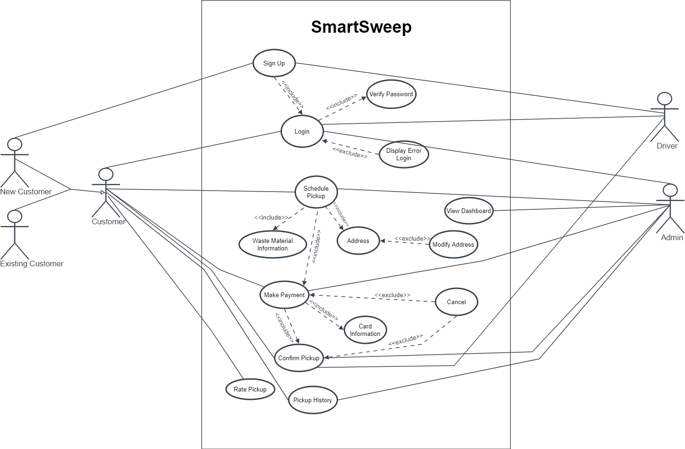
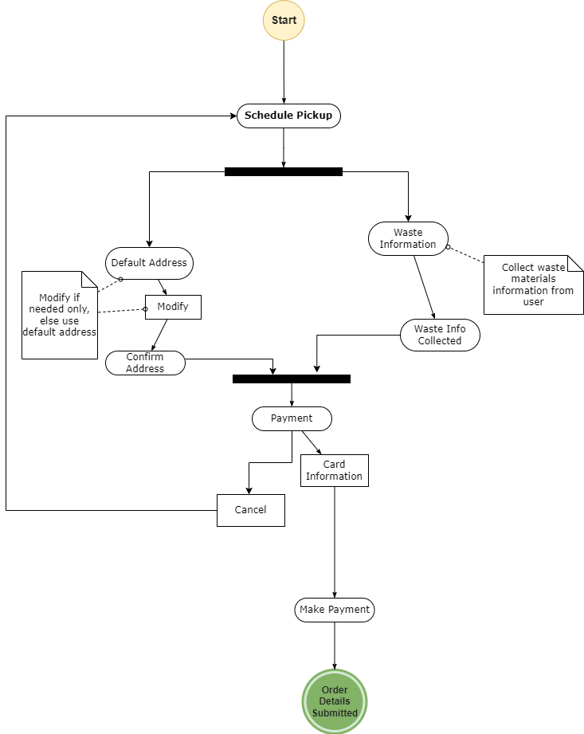
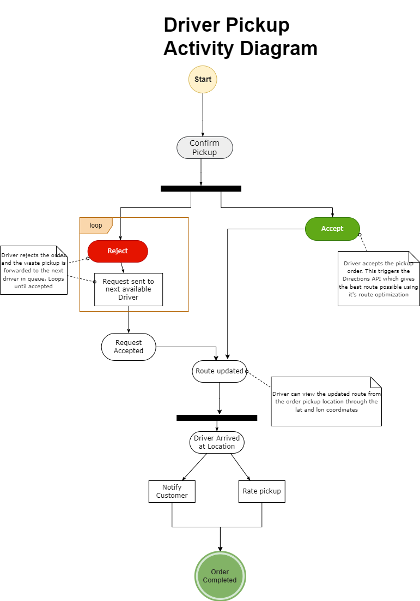

# Smart Sweep

  

  
##  **Table of Contents**
- [Problem Statement](#problem-statement)
- [Problem Scope](#problem-scope)
- [Application Benefit](#application-benefit)
- [Use Case Diagram](#use-case-diagram)
- [Activity Diagram](#activity-diagram)

## Problem Statement

Canada ranks poorly in waste management among OECD countries, but this also presents opportunities for improvement. The SmartSweep project aims to develop a waste management software that allows businesses to monitor and improve their waste disposal methods. The software includes features such as data analysis, smart routing, and live tracking of waste pickups. SmartSweep falls under the domain of "Distribution Management" and "Supply Chain."

## Problem Scope

The web-based waste management app aims to enhance the waste management process with its numerous features. The interaction between back-end and front-end web pages is shown in the picture to illustrate how various users will engage with the application.

  

## Application Benefit

- SmartSweep waste management software improves efficiency through data analysis and live tracking of waste pickups.
- SmartSweep helps businesses achieve sustainability goals by measuring progress and identifying areas for improvement.
- SmartSweep offers a comprehensive software solution for waste management with data analysis and reporting features.
- SmartSweep's live tracking feature helps businesses manage waste pickups more efficiently.
- Compared to Waste Management Inc., SmartSweep provides a more comprehensive software solution for waste management.
- Compared to RecycleSmart, SmartSweep offers a more comprehensive solution with live tracking of waste pickups and data analysis and reporting features.

## Use Case Diagram

  

## Activity Diagram

Here are two instances of an Use cases.

- Use Case 1 : Scheduling Pickup

  

- Use Case 2 : Confirm Pickup

  

